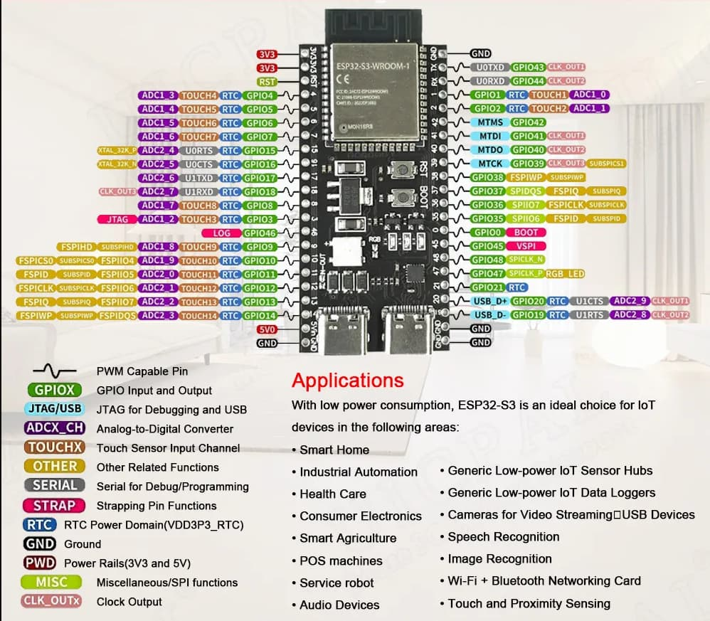
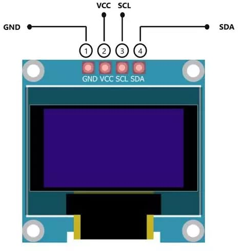
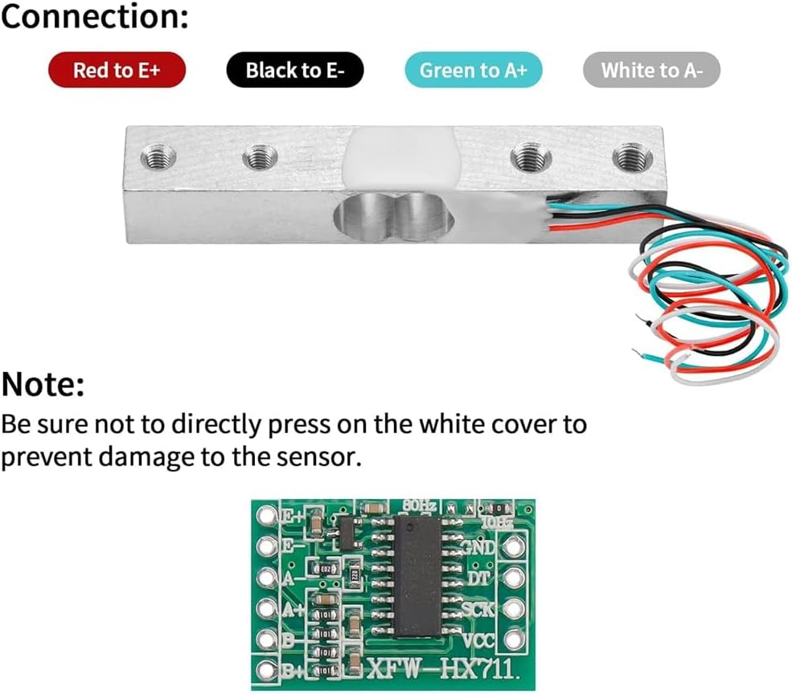
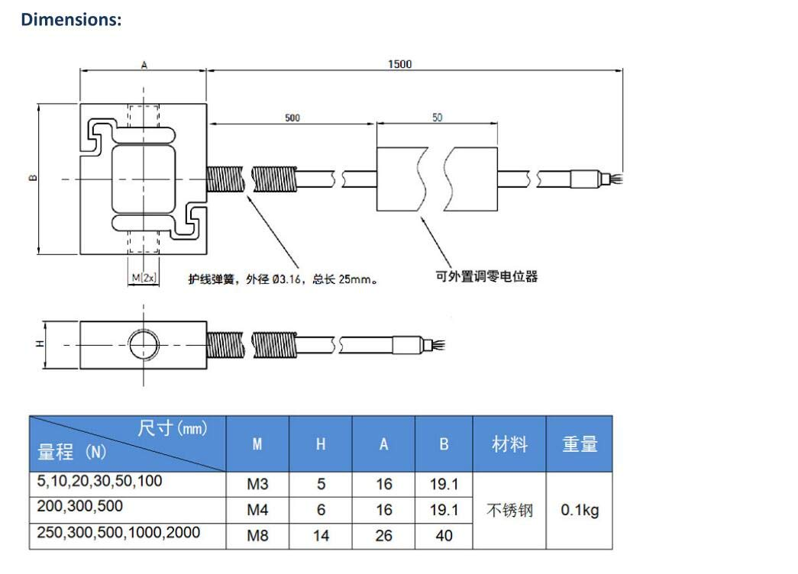
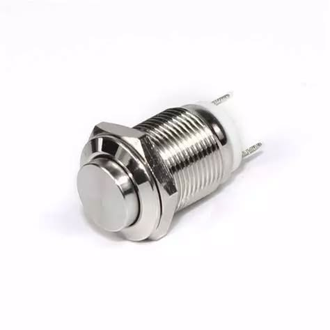

# ESP32 Force Meter
Micropython code for a custom force-meter
---
## Context :

With my PompeTrack project (tracking Pompe disease), I wanted to measure my strenght evolution (arms and legs);
So to have a real tracking, I needed numbers, something measurable, and that's a dynamometer which can give me it.

I've bought a simply "hand dynamometer" for hands, but for legs and arms, I've not found something proper, so i make it !!

# Step 1 - Hardware :

> 1. Main board :

* `Sixpan S3-N16R8` module (ESP32-S3)  




> 2. Oled screen :

* `gm009605v4.3` - I2C communication



> 3. Amplifier :

* `hx711` deliver with an electronic load (20Kg for my vetsion)



> 4. Dynamometer :

* `DYLY-108 - 1000N` --> 100Kg max force | supply 5~10V




> 5. Push-button

* `generic momentary button` 



---
## Pinning

### ESP32-S3 → HX711 amplifier

|HX711|ESP32-S3|Notes|
|---|---|---|
|VCC|3.3V||
|GND|GND||
|DT (DATA)|GPIO 4||
|SCK (CLOCK)|GPIO 5||

### ESP32-S3 → OLED SSD1306 screen

|OLED|ESP32-S3|Notes|
|---|---|---|
|VCC|3.3V||
|GND|GND||
|SCL|GPIO 9|I2C Clock|
|SDA|GPIO 8|I2C Data|

### ESP32-S3 → Push button

```
GPIO 17 ──── [Button] ──── GND
GPIO 17 ──── [Resistor 10kΩ] ──── 3.3V  (pull-up)
```

### ESP32-S3 → HX711 → Dynamometer DYLY-108

```
Dynamometer            HX711
Green  (A-)    ─────   A-
White  (A+)    ─────   A+
                    |  E+ => 5V 
                    |  E- => GND
Red    (E+) => 10V  |
Black  (E-) => GND  |
Yellow (BARE) => GND|


```
> ⚠️ DYLY-108 is a 4-wires Wheatstone bridge. Be careful to the colour wire.
It recommands 5~10V, so i add a 10V supply for the dynamometer to improve measure.


---
# Step 2 - Software :

## 1. Embedded firmware : 
To implement a language I know, I installed *micropython* on the module.  

Using `Sixpan S3-N16R8` module (ESP32-S3), and installed :
`micropython V1.27.0`

> Installation instructions found on : [https://micropython.org/download/ESP32_GENERIC_S3/](https://micropython.org/download/ESP32_GENERIC_S3/)

## 2. Micropython IDE :
To edit code and directly upload on the board, I found the perfect software :  
**[Thonny](https://thonny.org/)**